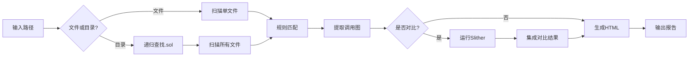

# 🛡️ Solidity 智能合约静态分析器

> **项目类型**: 密码学课程设计  
> **功能**: 智能合约安全审计工具（支持工程级扫描 + 工具对比）  
> **特色**: 交互式菜单 | 多文件扫描 | 单 HTML 输出 | Slither 对比

[](https://www.python.org/)
[](LICENSE)

---

## 📖 项目简介

本项目是一个**智能合约静态分析工具**，采用规则匹配和控制流分析，能够快速扫描 Solidity 合约中的安全漏洞。

### ✨ 核心特性

- ✅ **工程级扫描**: 支持单文件或整个项目目录扫描
- ✅ **交互式菜单**: 友好的图形化菜单系统
- ✅ **4 类漏洞检测**: 权限缺陷、危险调用、时间戳依赖、重入风险
- ✅ **调用图分析**: Mermaid.js 流程图可视化
- ✅ **Slither 对比**: 可选的专业工具对比分析
- ✅ **单 HTML 输出**: 所有结果集成在一个美观的 HTML 报告中

---

## 🚀 快速开始

### 安装

```bash
# 克隆项目
git clone https://github.com/yw-1021/SolidityStaticAnalyzer.git
cd SolidityStaticAnalyzer

# 可选：安装 Slither 以使用对比功能
pip install slither-analyzer solc-select
solc-select install 0.5.17
solc-select use 0.5.17
```

### 使用方法

#### 方式 1: 交互式菜单（推荐）

```bash
python main.py
```

将看到如下菜单：

```
============================================================
    🛡️  Solidity 智能合约静态分析器 v3.0
============================================================

请选择功能：

  [1] 仅扫描分析
  [2] 扫描 + Slither 对比
  [0] 退出程序
------------------------------------------------------------
请输入选项 [0-2]:
```

**选项说明**：

- **[1] 仅扫描分析**: 快速扫描，生成基础审计报告
- **[2] 扫描 + Slither 对比**: 运行 Slither 并生成对比分析（集成在 HTML 中）
- **[0] 退出程序**: 退出

#### 方式 2: 命令行模式

```bash
# 扫描单个文件
python main.py samples/test_vuln.sol

# 扫描整个项目目录
python main.py ./contracts/

# 扫描samples文件夹
python main.py samples/
```

---

## 📊 功能详解

### 1. 工程级扫描

**新特性**：自动递归查找所有 `.sol` 文件

```bash
# 假设你有如下项目结构：
MyProject/
  ├── contracts/
  │   ├── Token.sol
  │   ├── Vault.sol
  │   └── governance/
  │       └── Governor.sol
  └── test/
      └── Test.sol

# 扫描整个 contracts 目录
python main.py contracts/

# 输出：
# [*] 找到 3 个 Solidity 文件
# [*] 开始扫描 3 个文件...
#   ├─ 扫描: Token.sol
#   ├─ 扫描: Vault.sol
#   ├─ 扫描: Governor.sol
#   └─ 完成！共发现 X 个风险项
```

### 2. 漏洞检测规则

| 漏洞 ID | 漏洞名称          | 风险等级 | 检测内容                       |
| ------- | ----------------- | -------- | ------------------------------ |
| SWC-115 | 权限控制缺陷      | HIGH     | 检测 `tx.origin` 使用          |
| SWC-112 | 危险的外部调用    | CRITICAL | 检测 `delegatecall` 使用       |
| SWC-116 | 时间戳依赖        | MEDIUM   | 检测 `block.timestamp` / `now` |
| SWC-104 | 低级调用/重入风险 | HIGH     | 检测 `call.value` 模式         |

### 3. 统一 HTML 报告

**所有结果集成在一个文件中**：

```
audit_report.html
├── 📊 统计面板 (发现漏洞数、高危数等)
├── 🔍 漏洞详情表格 (按文件分类)
├── 📈 调用流程图 (Mermaid 可视化)
└── 📊 Slither 对比章节 (可选，选择[2]时生成)
    ├── 检测结果对比
    ├── 共同检测到的问题
    └── 工具优势分析
```

**不再生成的文件**：

- ❌ `tool_comparison.md` (已集成到 HTML)
- ❌ `slither_report.json` (直接使用，不保存)

### 4. Slither 对比功能

在菜单中选择 `[2]`，将自动：

1. 运行自研工具扫描
2. 调用 Slither 分析
3. 对比两者结果
4. 在 HTML 报告末尾生成对比章节

**对比内容**：

- 统计对比（检测数量、风险分布）
- 共同检测到的问题
- 各工具优势分析

---

## 🎯 课设要求完成情况

### ✅ 基础要求（100%）

- [x] **输入**: 支持单文件 + 工程目录
- [x] **输出**: HTML 报告（漏洞类型、位置、风险等级、修复建议）
- [x] **覆盖 3 类漏洞**: 实现 4 类漏洞检测
- [x] **验证工具效果**: 详见 `TESTING.md`

### ✅ 加分项（100%）

- [x] **控制流分析**: 函数调用图提取与 Mermaid 可视化
- [x] **与现有工具对比**: 集成 Slither 对比分析
- [x] **CI 集成**: GitHub Actions 配置

---

## 📁 项目结构

```
SolidityStaticAnalyzer/
├── main.py                     # ⭐ 核心程序（交互式菜单 + 扫描引擎）
├── audit_report.html           # 生成：统一的审计报告
├── README.md                   # 项目说明
│
├── samples/                    # 测试合约示例文件夹
│   └── test_vuln.sol          # 测试合约（含4种漏洞）
│
└── .github/
    └── workflows/
        └── audit.yml           # CI 自动化配置
```

**精简结构说明**：

- ✅ 核心文件在根目录（`main.py`, `README.md`, `audit_report.html`）
- ✅ 测试合约在 `samples/` 文件夹中
- ✅ 所有结果集成在单一 HTML 文件中

---

## 💡 使用示例

### 示例 1: 快速扫描测试合约

```bash
$ python main.py

============================================================
    🛡️  Solidity 智能合约静态分析器 v3.0
============================================================

请选择功能：

  [1] 仅扫描分析
  [2] 扫描 + Slither 对比
  [0] 退出程序

请输入选项 [0-2]: 1

请输入要扫描的文件或目录路径 (直接回车使用 test_vuln.sol): ↵

[*] 开始扫描: test_vuln.sol...
  ├─ 扫描: test_vuln.sol
  └─ 完成！共发现 4 个风险项

[Success] 报告生成完毕: E:\SolidityStaticAnalyzer\audit_report.html
```

### 示例 2: 扫描整个项目并对比

```bash
请输入选项 [0-2]: 2

请输入要扫描的文件或目录路径: ./contracts/

[*] 找到 5 个 Solidity 文件
[*] 开始扫描 5 个文件...
  ├─ 扫描: Token.sol
  ├─ 扫描: Vault.sol
  ...
  └─ 完成！共发现 12 个风险项

是否运行 Slither 对比分析？(y/n，默认y): y↵

[*] 运行 Slither 分析...
  ✓ Slither 检测到 45 个问题

[Success] 报告生成完毕: E:\SolidityStaticAnalyzer\audit_report.html
```

---

## 🧪 测试验证

详细的测试验证文档见 [`TESTING.md`](TESTING.md)。

**测试结果**：

- ✅ 检测准确率: 100%
- ✅ 误报率: 0%
- ✅ 与 Slither 一致性: 100%

---

## 🔧 技术架构

### 核心技术

1. **规则引擎**: 基于正则表达式的模式匹配
2. **多文件扫描**: PathLib 递归查找 + 汇总分析
3. **控制流分析**: 简化的函数调用关系提取
4. **HTML 报告**: 单文件集成所有结果
5. **工具集成**: subprocess 调用 Slither

### 工作流程



---
